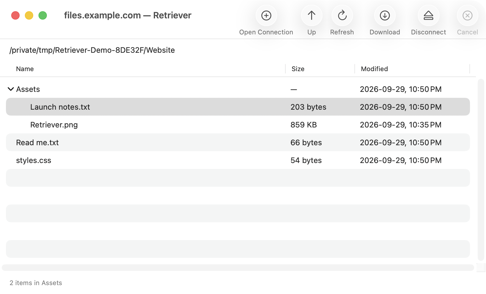

# Retriever

**A native Mac app for bringing files home from your servers.**

Retriever started with a small task: grab a few files from a server without opening a terminal. The result is a focused SFTP browser written in Swift and AppKit, inspired by Cyberduck’s simplicity.

Connect, browse, preview, download, and upload. Retriever uses macOS controls and the system SSH client, with no third-party app dependencies.

[Download for Mac](https://sojoodi.com/apps/Retriever/) · [Source code](https://github.com/ssojoodi/retriever) · [Release notes](https://sojoodi.com/apps/Retriever/release-notes.html) · [MIT license](LICENSE)



## Using Retriever

Requires **macOS 14 or later**. Release builds include Apple silicon and Intel binaries; Intel runtime testing remains pending.

- **Return to your servers.** Successful connections remember the host, account, port, and last visited folder.
- **Browse folders in place.** Expand the file tree, navigate with arrow keys, or double-click a folder to open it.
- **Preview before saving.** Press Space or choose Preview from a file’s context menu. Escape closes the preview or cancels its download. Files larger than 1 MB require confirmation.
- **Download where you choose.** Use the native Save dialog, approve replacement of an existing file, and cancel active transfers.
- **Upload to the current folder.** Choose Upload (⌘U), select one local file, and approve any replacement. Cancel stops an active transfer.
- **Find previous downloads.** Open Downloads with ⇧⌘J and use Show in Finder. Clearing history leaves your files on disk.
- **Recover without losing your place.** File errors preserve usable connections. If a connection closes, the listing stays visible and Reconnect lets you resume.

Connect with SSH keys, an SSH agent, or a password. Retriever asks you to verify a new server’s fingerprint and rejects changed host keys. Passwords are never saved; accepted server keys stay in OpenSSH’s `known_hosts` file.

This branch supports SFTP and individual file uploads and downloads. Uploads are not yet in the published 0.3.0 release. FTP, folder transfers, and symbolic-link transfers are not available.

## Build and run

You need macOS 14 or later and **full Xcode with a Swift 6 toolchain**. Local development builds are unsigned and need no Apple Developer credentials.

```sh
git clone https://github.com/ssojoodi/retriever.git
cd retriever
make build
make run
```

`make run` builds the app and opens it. Command-line build output goes to `.build/DerivedData`; `make paths` prints the app location.

To work in Xcode, open `Retriever.xcodeproj`, select the **Retriever** scheme, and run. The Xcode project is the source of truth for builds, so add new Swift files to the appropriate target. Icon assets are already included in the repository.

For a universal Release build:

```sh
make build-universal
```

This builds and verifies both arm64 and x86_64 slices. Signing and notarization happen in the separate release step.

## How it works

Retriever keeps the interface, connection logic, and SSH transport separate:

```text
AppKit interface
      │
      ▼
SFTPBrowser actor ──► SFTPSession ──► system SSH ──► SFTP server
                                          │
                                          ▼
                               Native authentication prompts
```

| Part | Responsibility |
| --- | --- |
| [`RetrieverApp`](Sources/RetrieverApp) | AppKit windows, file outline, connection sheet, Quick Look previews, download history, and native SSH authentication prompts. |
| [`RetrieverCore`](Sources/RetrieverCore) | Connection settings, SFTP packet handling, directory listings, transfers, cancellation, and persisted connection/download metadata. |
| [`Tests`](Tests) | Core XCTest cases and native UI/SSH integration checks using disposable local fixtures. |

`SFTPBrowser` owns the session on a dedicated worker so network reads and writes stay off the main thread. `SFTPSession` speaks SFTP v3 through `/usr/bin/ssh`; SSH handles encryption, authentication, and host-key verification. Remote filenames retain their original bytes.

Downloads go to a temporary file beside the destination and become visible only after completion. Replacement requires explicit approval. Previews use a private temporary directory, which is removed when the preview closes.

Uploads use a private temporary remote file and publish after all writes succeed. Replacement requires server support for atomic rename. If a connection fails, Retriever reports when a temporary file may remain or the final upload outcome is uncertain. Uploaded files have owner-only read/write permissions.

The static download website lives in [`web-page`](web-page). Brand artwork lives in [`Brand`](Brand), and shared version settings live in [`Config/Signing.xcconfig`](Config/Signing.xcconfig).

## Check your changes

```sh
make test            # Core XCTest suite
make check-ssh       # Real SSH transport and authentication checks
make check-windows   # Native window behavior and lifecycle
make check-browser   # Connection, browsing, previews, downloads, and uploads
```

The integration checks need Python 3. Window and browser checks also need a logged-in macOS GUI session. SSH fixtures use temporary keys on a loopback server; no personal server credentials are needed.

For a manual check of the built app:

```sh
python3 scripts/manual_browser_check.py
```

The script opens Retriever and prints the temporary server’s connection details and fingerprint. Quit that app instance to stop the fixture. Native Save/Replace and Finder interactions remain part of manual verification.

## Prepare a release

Copy `release.env.example` to the ignored `release.env` and set an existing Developer ID signing identity and notarization Keychain profile. The file uses Make syntax.

Run this in an interactive terminal:

```sh
make release
```

The release process builds a universal app, signs and notarizes the app and branded DMG, and opens a copy for manual verification. After verification, it places the DMG, checksum, and release metadata in `web-page/` and backs up the previous artifacts locally. Upload the website separately.

Public releases increment the middle version number: **0.1.0 → 0.2.0 → 0.3.0**, continuing until 1.0.0. There is no separate build counter.

## License

Retriever is [MIT licensed](LICENSE). Copyright © 2026 Sahand Sojoodi.
